# FastAPI Assignment — *CineHub*

**Repository:** [https://github.com/mikhail2574/sdt-208-6-fastapi-core](https://github.com/mikhail2574/sdt-208-6-fastapi-core)

## How to run

```bash
pip install -r requirements.txt
./run.sh
# visit: http://127.0.0.1:8000/hello  and  http://127.0.0.1:8000/docs
```

---

## Part 1. Basic App and Hello Route (5 pts.)

**Demonstration**

**Part 1. Screenshots:**  


---

## Part 2. Path and Query Parameters (5 pts.)

- `GET /greet/{name}` → `"Hello, {name}!"`  
- `GET /square?number=4` → `16`

**Part 2.1. Screenshots:**  


**Part 2.2. Screenshots:**  
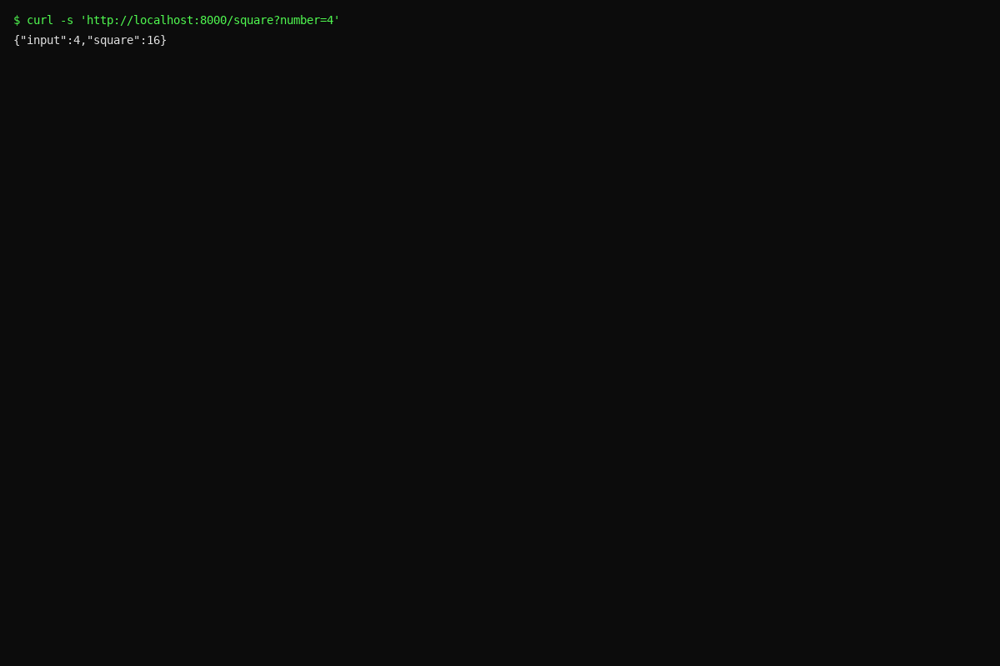  
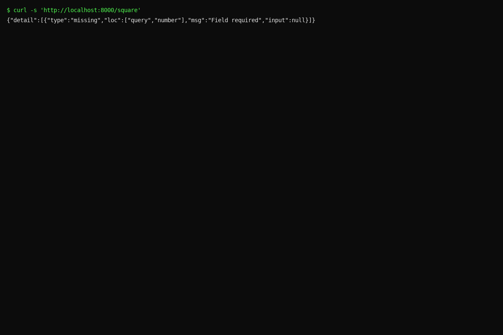

---

## Part 3. Create & Update Domain Objects with Pydantic Validation (10 pts.)

Domain: **Movies** (`title`, `rating`, `year`, optional `description`).

**Part 3. Screenshots:**  
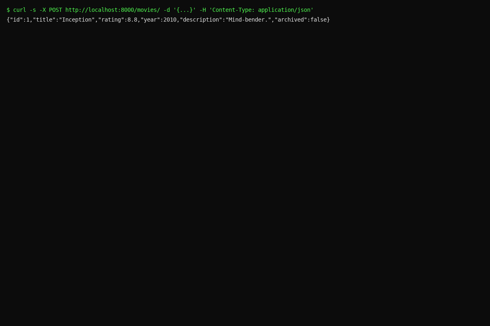  
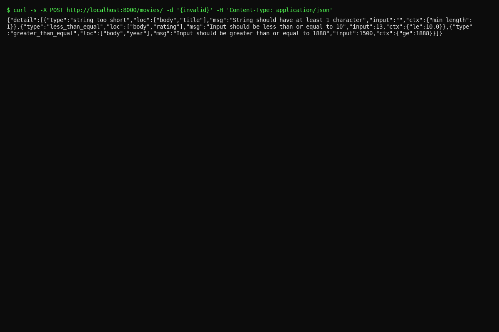  
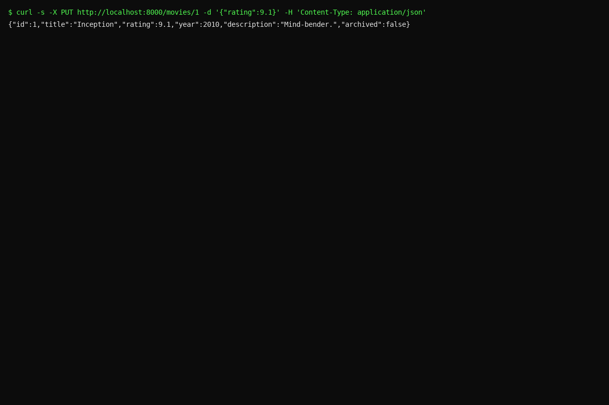  
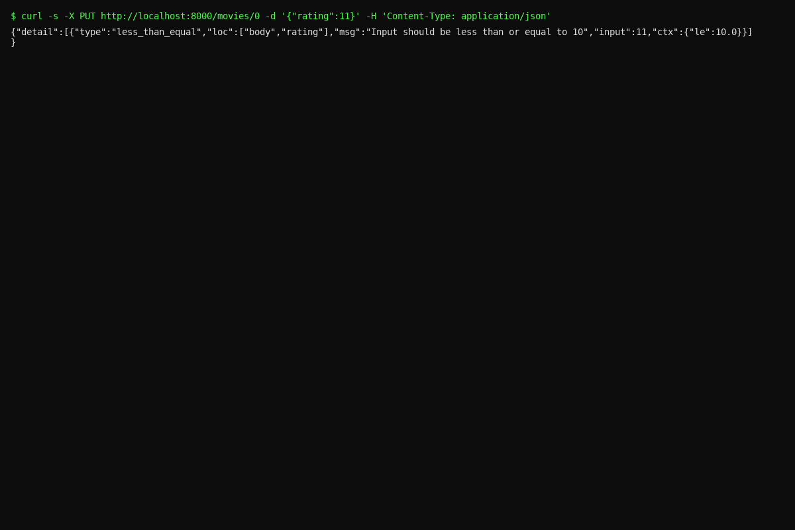

---

## Part 4. Routers (5 pts.)

Routers used: **Basics & Params**, **Health**, **Info**, **Movies**, **Movies HTML**, **Security**.  
Visible separation in `/docs` via tags.

**Part 4. Screenshots:**  
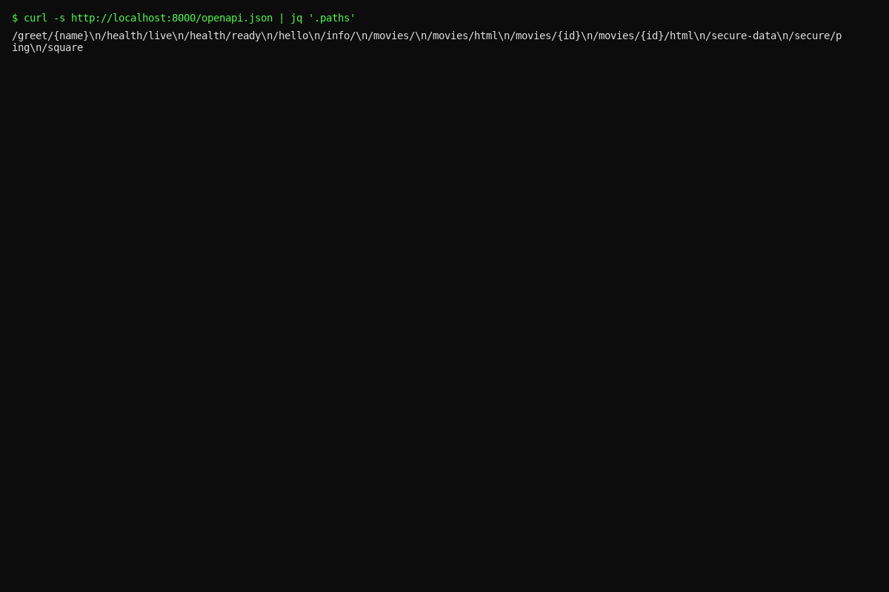

---

## Part 5. Retrieve with Validation & Error Handling (10 pts.)

- `GET /movies` → active movies  
- `GET /movies/{id}` → 400/404/410 path validation & status codes  
- `DELETE /movies/{id}` → soft-delete via `archived=True`

**Part 5. Screenshots:**  
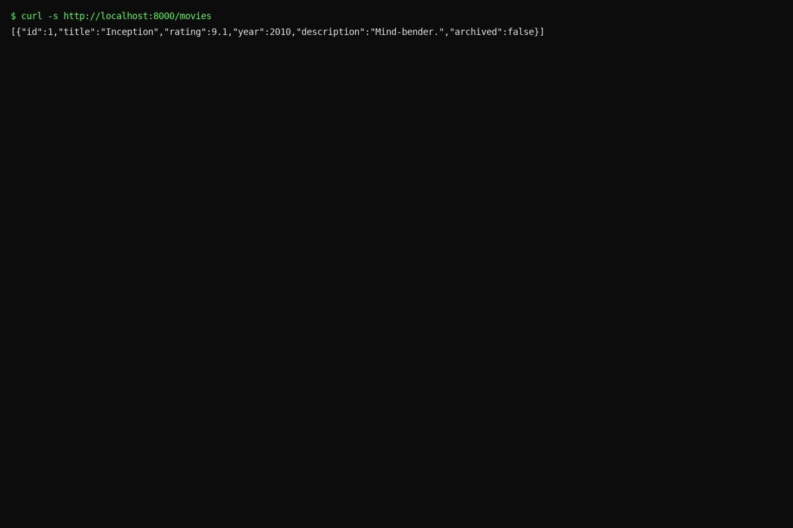  
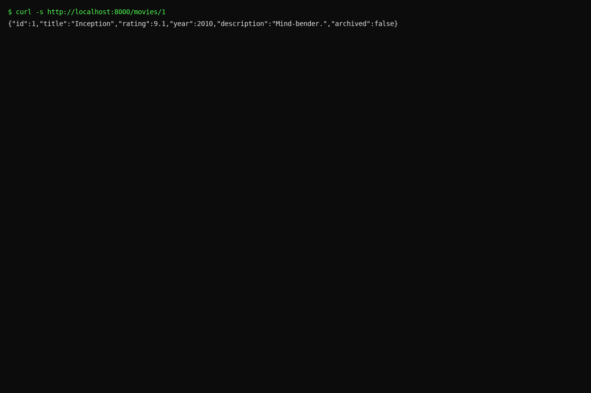  
  
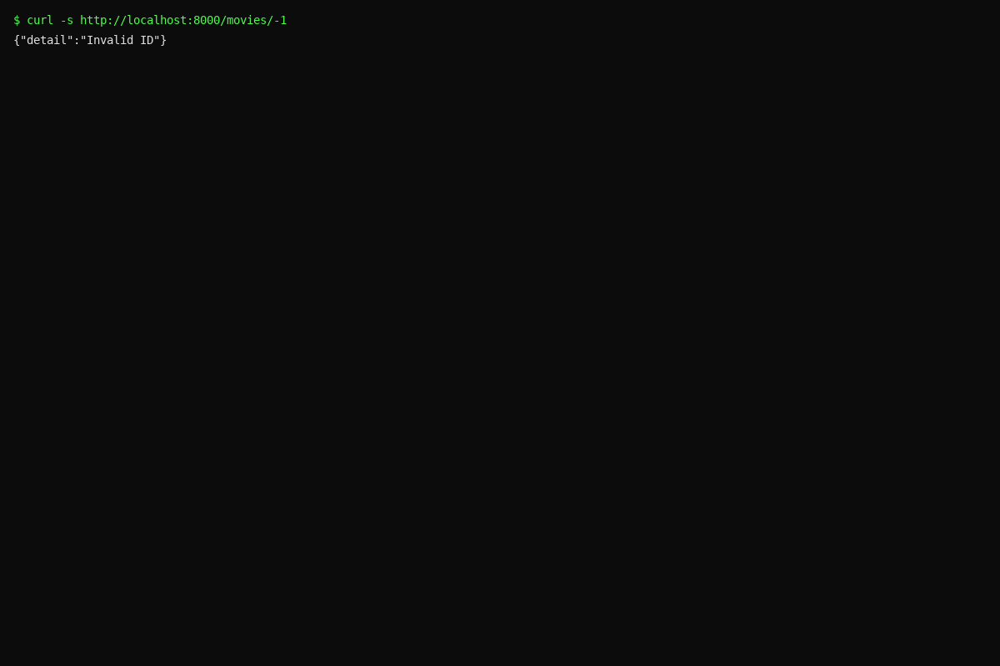  
  
  
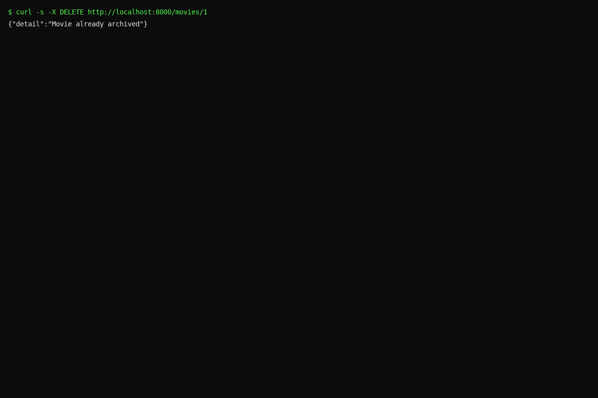

---

## Part 6. HTML Templates (10 pts.)

Jinja2 with `templates/` and static files.  
- `GET /movies/html`
- `GET /movies/{id}/html`

**Part 6. Screenshots:**  
  
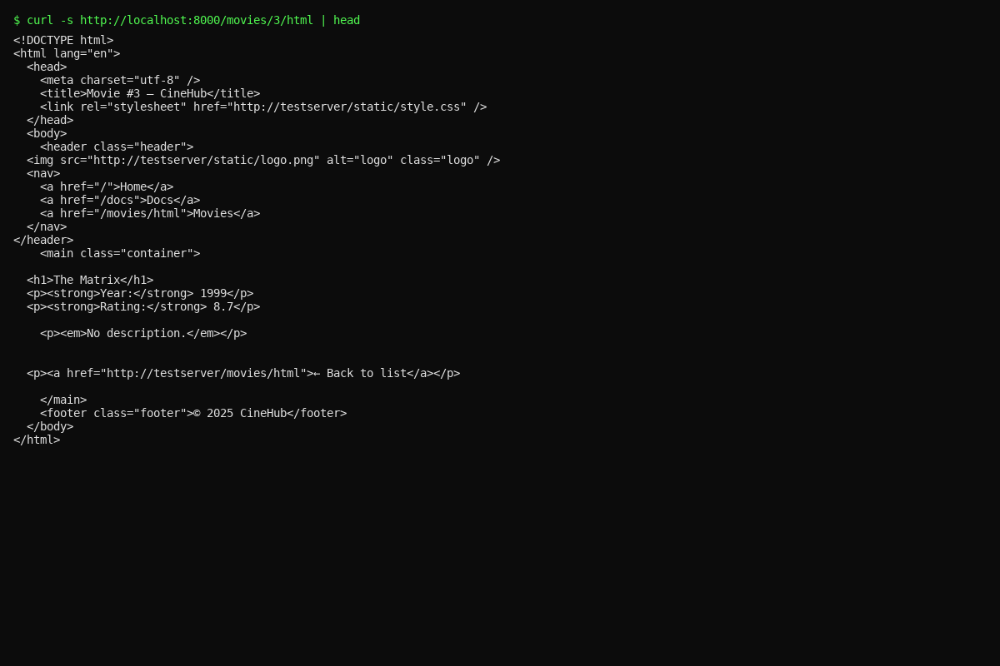

---

## Part 7. Dependency Injection & Security (10 pts.)

Token: `letmein`. Pass via header `X-Token` or query `?token=`.

**Part 7. Screenshots:**  
  
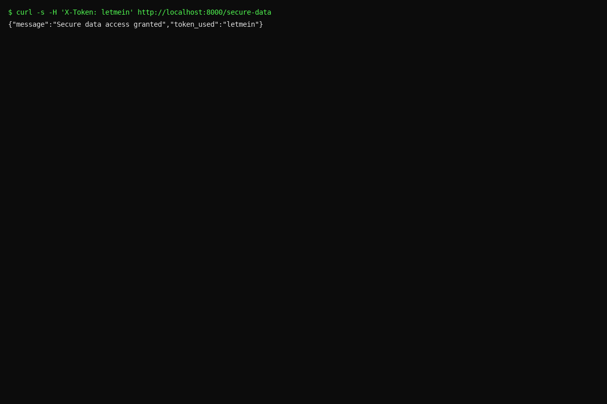  
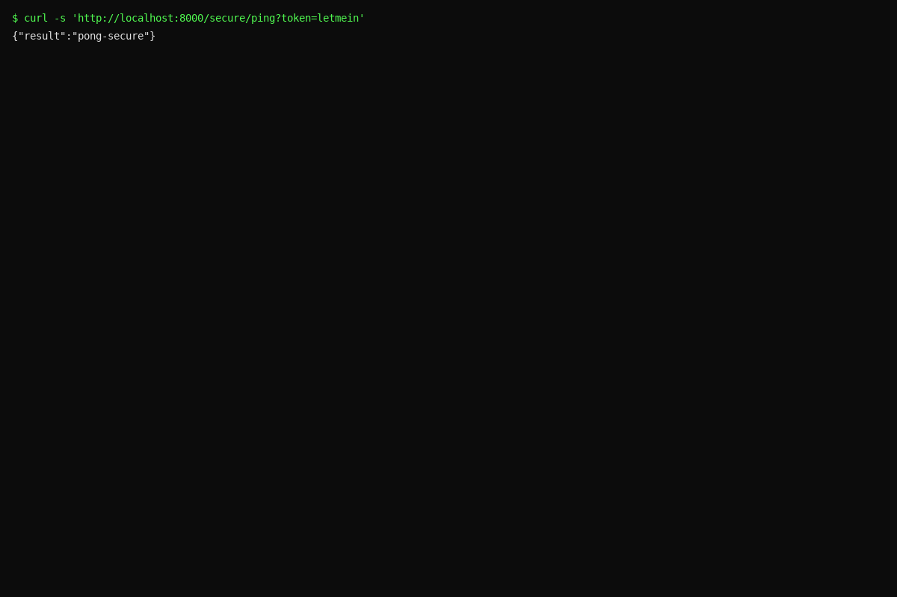

---

### Notes

- Python modules are named according to the project and task numbers: `cinehub_part2_params.py`, `cinehub_part3_models.py`, etc.
- Input/output schemas for POST/PUT are distinct (`MovieCreate`, `MovieUpdate`, `MovieOut`).
- Validation is enforced via Pydantic `Field` constraints and FastAPI type hints.
